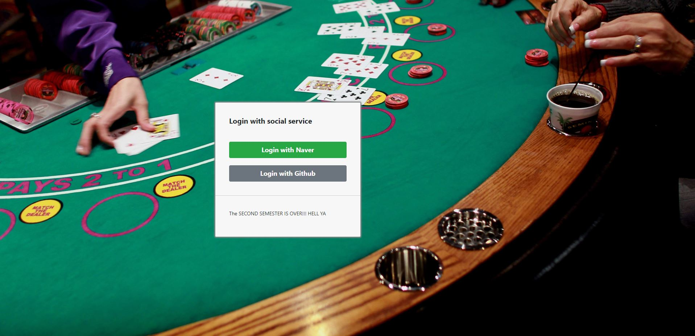
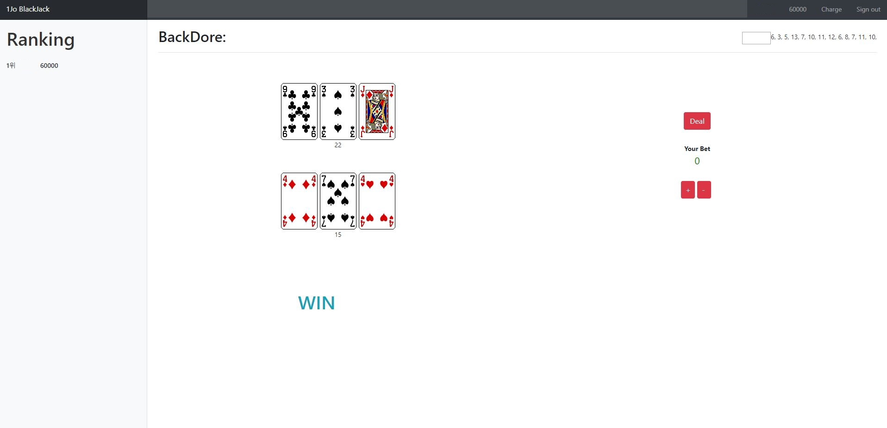
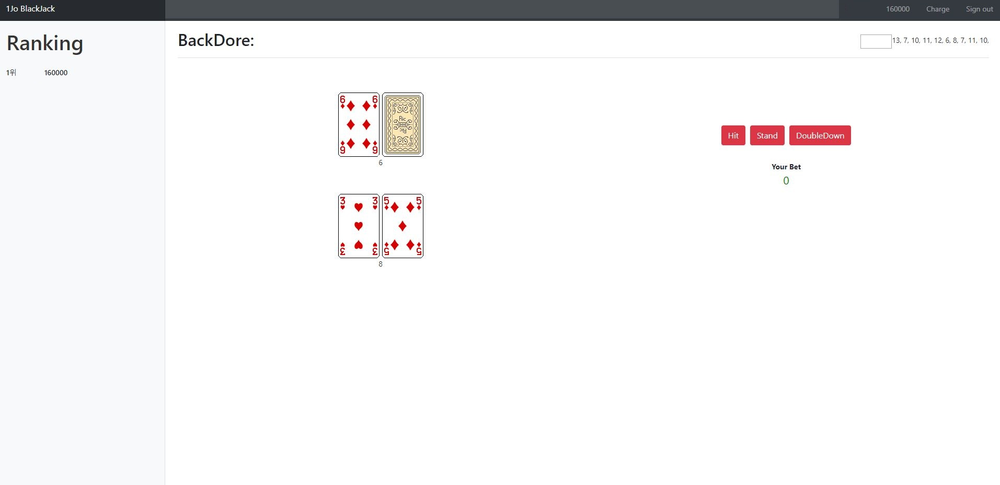

# Black Jack



AWS상에서 Jenkins를 통해 Spring Framework를 공부하기 위하여 제작한 블랙젝 형태의 게임 서비스      
---
## Installation
1. Download Intellij     
2. Download Java 8.0      
3. Set hosts file    
```
	Add below host    
	127.0.0.1 local.robin.com    
	13.124.119.160 robin.com     
	hosts file path    
	on Window: windows/system32/drivers/etc/hosts     
	on Linux /etc/hosts    
```

## Start
### run on intellij
1. run main method on LectureApplication      
2. http://local.robin.com:888x/blackjack/index.html    
   http://robin.com:888x/blackjack/index.html    

### run on AWS or PCs without intellij
1. Make AWS Linux server or Download Jenkins
2. Install Jenkins
3. Add github webhook to jenkins
4. access to http://robin.com:888x/blackjack/index.html     

## Guide
### config
SecurityCongiguration.java: Spring Oauth2.0 Setting
### controller
데이터베이스 컨트롤을 위한 클래스 파일 들   
### domain 
게임에 이용되는 사용자 객체들    
### exception
게임에서 발생하는 오류들을 runtimeException으로 처리하기 위한 exception들     
### game.blackjac
게임에 필요한 룰, 알고리즘    
### repository
게임에서 발생하는 데이터를 데이터베이스에 기록하기 위한 클래스 파일     
### service
게임 동작 서비스     
### resources
게임 웹 인터페이스를 위한 파일들   
### application.yml
접속 포트 설정등 전반적인 설정을 위한 파일    

## Tech
- Spring Boot
- Bootstrap 4.0
- Ajax
- Naver(like korean google or yahoo) ID login API
- Oauth2.0
- Maven

## Ref
* https://spring.io/guides/tutorials/spring-boot-oauth2/
* https://html5blackjack.net/    

## Func
- [x] double down 기능이 있으면 좋겠네요. (Blackjack 에서 Double 이 뭔지 알아보세요.)
- [x] 현재 View 가 가시적이지 않네요. 화면 제일 윗쪽에 내 이름과 현재 내가 보유한 금액을 표시해 주세요.
- [x] Blackjack 이면 1.5배를 돌려받아야 할 것 같아요.
- [x] 화면 한쪽에, Account 가 높은 순서대로 Ranking 이 나오면 좋겠어요.
- [x] 게임이 끝난 후 이전에 배팅했던 금액이 default bet 금액이 되면 좋겠어요.
- [x] 현재 betting 기본 금액이 100원 이네요. 1000원으로 올려 주세요.
- [x] betting 상한선은 10000원 입니다. (server side 에서도 체크해야 할꺼에요.)    
- [x] 만약 내가 가진 돈이 기본 배팅금액 이하일 경우, all-in 되도록 해주세요.
- [x] 게임이 끝나고 Deck에 남은 카드가 10장 이하인 경우 새롭게 shuffle 되도록 해주세요. 
- [x] 게임 결과를 화면에 출력하는 기능 추가 - 1조
- [x] 게임머니 충전기능 추가 한번 충전에 50000점 충전 - 1조      
